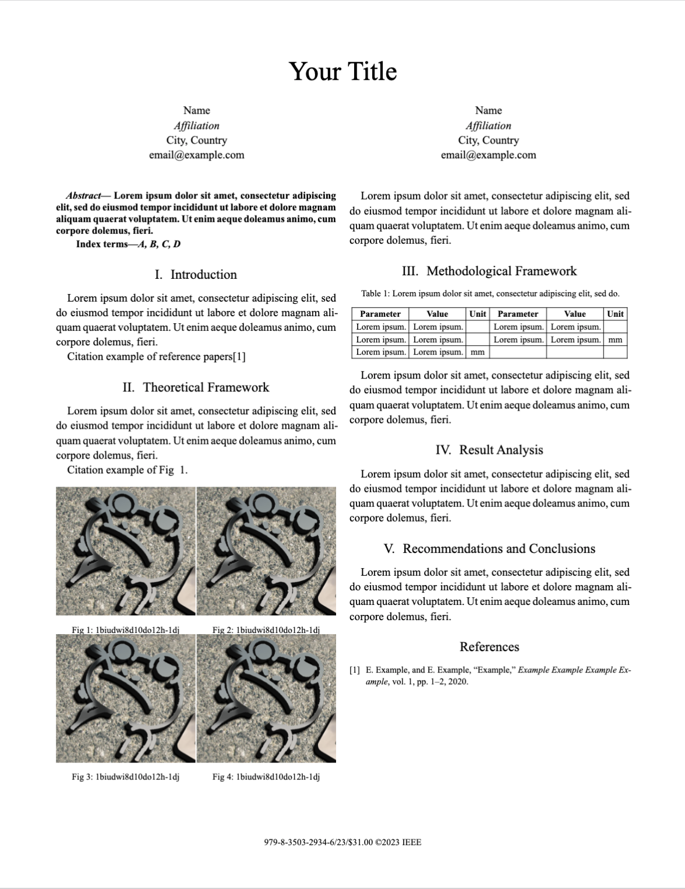
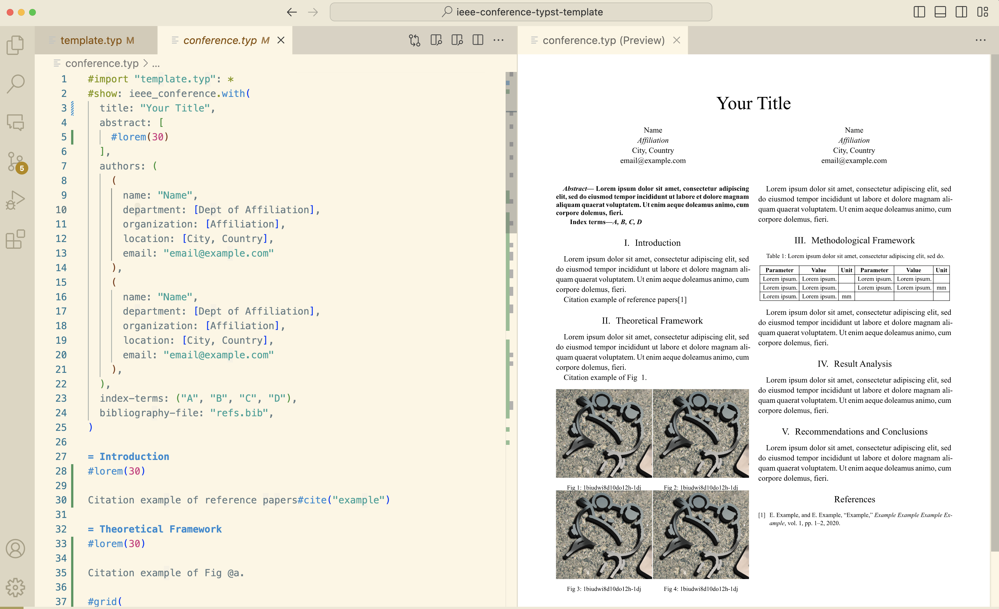

# IEEE Conference [Typst](https://typst.app) Template
I am preparing for IEEE cofference these days. Frustrated with Latex, I choose Typst to rewrite my paper.

In fact, typst app provides built-in IEEE paper template and [ieee-typst-template](https://github.com/bsp0109/ieee-typst-template) gives a modified edition for author's requiements, but they are not enough.

Based on Word and Latex templates and format guidelines, I diy my Typst template.

## What is Typst
Typst is a new markup-based typesetting system that is designed to be as powerful as LaTeX while being much easier to learn and use.

- [Typst Github](https://github.com/typst/typst)
- [Typst Homepage](https://typst.app)

## Features
- IEEE copyright on the first page.
- Top captions for tables.
- ...

## Preview
See the [main.pdf](main.pdf).

## Usage:
You can try it online ([Click Me](https://typst.app/project/rgsg7a58qn3fKa7jPhbl2U)) or run locally.I strongly recommand writing with VSCode. 

## Contribute
Welcome to PRs.
